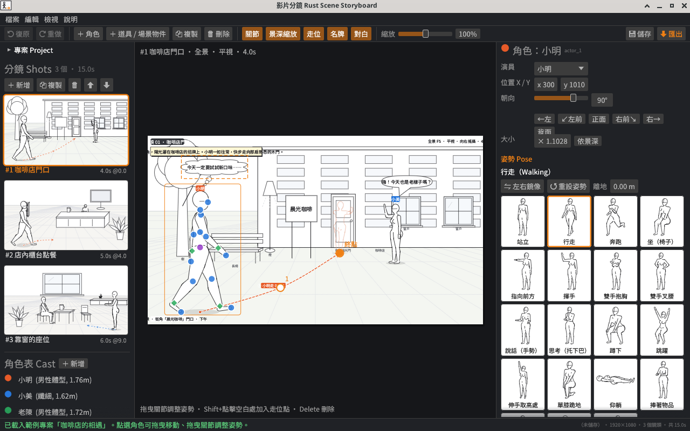
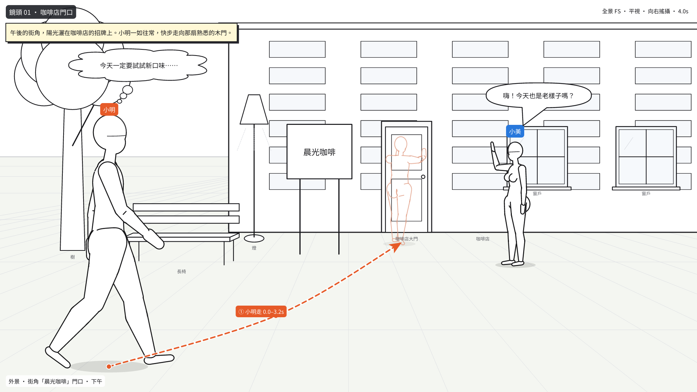
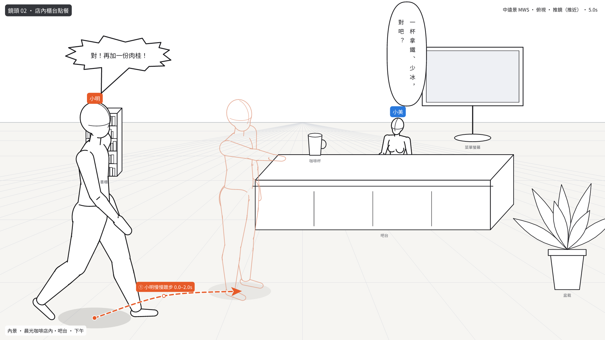
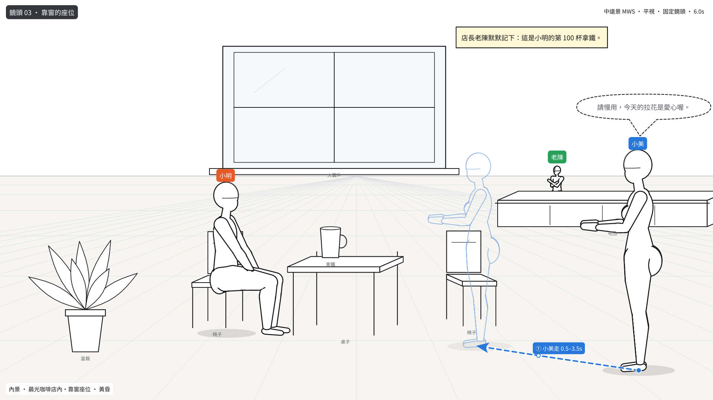

# 影片分鏡 Rust Scene Storyboard

以 **線稿人偶** 設定影片中的 **角色、姿勢、走位、道具與場景**，輸出 **草稿圖（PNG）** 與 **Markdown / HTML 分鏡敘述**的 Rust 桌面 GUI 工具。

> **English summary** — *Rust Scene Storyboard* is an egui/eframe desktop app for blocking video shots. Place one or more line-art mannequins (17-joint posable figures from [rust-pose-studio](https://github.com/stevenke1981/rust-pose-studio)) together with props and a set, give every character a pose, facing, scale, action, dialogue (comic/manga speech balloons: speech, thought, shout, whisper, caption box, optional vertical text) and a movement path, and organise the shots into a storyboard. It exports draft PNGs (line art + props + motion arrows + labels), a contact sheet, and a Traditional-Chinese `storyboard.md` / single-file `storyboard.html` that describe each shot (setting, camera, placement, facing, pose, movement, props). Projects are saved as JSON, and a headless CLI makes the same exports without a display. The storyboard / export / UI architecture follows [whitebox-video-storyboard](https://github.com/stevenke1981/whitebox-video-storyboard).



## 下載

到 [Releases](https://github.com/stevenke1981/rust-scene-storyboard/releases) 下載已編譯好的執行檔（推送 `v*` 標籤時由 GitHub Actions 自動建置）：

| 平台 | 檔案 |
|---|---|
| Linux x86_64 | `rust-scene-storyboard-vX.Y.Z-linux-x86_64.tar.gz`（需要 GTK3 / OpenGL，Ubuntu 22.04 以上） |
| Windows x86_64 | `rust-scene-storyboard-vX.Y.Z-windows-x86_64.zip` |
| macOS Apple silicon | `rust-scene-storyboard-vX.Y.Z-macos-aarch64.tar.gz` |
| macOS Intel | `rust-scene-storyboard-vX.Y.Z-macos-x86_64.tar.gz` |

壓縮檔內含單一執行檔（字型已內嵌）、README、授權與範例專案；每個檔案另附 `.sha256`。macOS 版本未簽章，第一次開啟請按右鍵 →「打開」，或執行 `xattr -d com.apple.quarantine rust-scene-storyboard`。

## 功能

- **多角色線稿人偶**（單人或多人同框）
  - 每位角色都是 rust-pose-studio 的 17 關節 3D 人偶，用它的線稿渲染器（隱藏線消除、輪廓線、白色填色）畫出。
  - **姿勢庫**：19 種動作姿勢（站立、行走、奔跑、坐、指向、揮手、抱胸、叉腰、說話、思考、蹲下、跳躍、伸手取高處、單膝跪地、仰躺、捧物、講電話、鞠躬、推門），加上 rust-pose-studio 的 25 種地面姿勢。
  - **直接在畫布上調整姿勢**：拖曳藍色關節點旋轉關節（FK），拖曳綠色菱形（手腕／腳踝）做 IK；也可以用滑桿微調關節角度、左右鏡像或重設姿勢。
  - 可設定位置、**朝向**（0° 面向鏡頭、90° 面向右、180° 背面…）、大小（可「依景深」自動計算透視大小）、離地高度。
  - 角色表（Cast）：名稱、顏色、身高、體型（纖細／標準／豐滿／男性體型）、頭身比例、角色描述。
- **道具與場景物件**：23 種線稿道具（箱子、椅子、桌子、沙發、床、門、窗、書櫃、櫃台、螢幕、燈、盆栽、樹、長椅、汽車、招牌、樓梯、建築物、牆、杯子、包包、球、自訂），可移動、縮放、翻轉、設定離地高度（例：桌上的杯子）。
- **場景設定**：地點、內／外景、時間（清晨～深夜）、天氣／光線、環境描述、地平線高度、透視地面格線。
- **鏡頭設定**：景別（大遠景～大特寫、過肩、主觀、雙人鏡頭）、角度（平視、俯視、仰視、鳥瞰、蟲視、荷蘭角，會改變人偶的觀看角度）、運鏡（搖、推拉、橫移、跟拍…）、鏡頭備註、旁白、導演備註。
- **走位**：每個角色可設定移動路徑（多個路徑點，在畫布上拖曳；Shift+點擊新增）、移動方式（走、跑、躡手躡腳、踱步、跳、爬…）、起訖時間、**終點姿勢與朝向**、終點殘影（ghost）與依景深縮放，草稿圖上畫出帶編號的虛線箭頭。
- **漫畫對白框**（每位角色的對白都可以選擇樣式，GUI 畫布與匯出 PNG 一致）
  - 💬 **對話**：圓角橢圓＋尖尾，尾巴自動指向說話者的頭部。
  - ☁ **內心獨白**：雲朵形外框＋由大到小的小圓圈連到角色。
  - 💥 **吶喊**：爆炸鋸齒框（字體稍大），最靠近角色的尖角延伸成尾巴。
  - ┄ **悄悄話**：虛線外框的對話泡泡。
  - □ **旁白框**：米色矩形說明框（無尾巴），適合角色的內心旁白或說明。
  - 對白框可直接在畫布上**拖曳移動**（儲存為相對自動位置的偏移量，角色移動時跟著走；「↺ 自動位置」可還原），尾巴會重新指向角色；可設定字級、換行寬度。
  - 中文自動換行（避頭點：「，。！？」等不會出現在行首）；可勾選**直書**（由右至左分欄，標點使用直排字形）。
  - 鏡頭的「旁白」可勾選「在草稿圖左上角顯示旁白框」。
  - `storyboard.md` / `storyboard.html` 會寫出對白樣式（例：「小明大喊：…」、「對白（吶喊泡泡（爆炸鋸齒框））」）。
  - 對白框樣式存在專案 JSON 的 `actors[].bubble`（`style`、`offset`、`wrap`、`vertical`、`text_scale`）與 `shots[].narration_box`；v0.1 的舊專案沒有這些欄位，開啟時自動使用預設的對話泡泡。
- **分鏡列表**：多個鏡頭（含縮圖），新增、複製、刪除、排序，各自設定長度。
- **匯出**（Ctrl+E，可勾選格式，輸出到「專案名_日期_時間」資料夾）
  - `shot_XX_<id>.png`：每個鏡頭的草稿圖（線稿人偶 + 道具 + 走位箭頭 + 名牌 + 漫畫對白框 + 旁白框 + 鏡頭資訊）。
  - `storyboard_overview.png`：所有鏡頭的總覽圖。
  - `storyboard.md`：繁體中文分鏡腳本——角色表、鏡頭列表，每個鏡頭的場景、攝影機、自動產生的畫面敘述、旁白、每位角色的位置（九宮格區域＋前／中／後景）、朝向、姿勢、大小、動作、表情、對白、走位（方向、距離、速度、終點姿勢）、人物相對位置、道具配置，以及 ASCII 平面示意圖。
  - `storyboard.html`：同樣內容的單一 HTML 檔（圖片以 base64 內嵌，可直接分享），含總覽格狀圖與角色表。
  - `project.json`：專案檔。
- **專案存檔**：JSON（`format: "rust-scene-storyboard/project"`），可開啟、儲存、另存；復原／重做。
- **繁體中文介面**：內嵌 Noto Sans CJK TC 子集字型（SIL OFL 1.1），並自動載入系統 CJK 字型當備援（可用 `RSS_FALLBACK_FONT` 指定）。
- **無頭 CLI**：不需要螢幕就能輸出 PNG / MD / HTML（CI、腳本、AI Agent 皆可用）。

## 範例輸出

`docs/sample/` 是內建範例專案「咖啡店的相遇」（3 個鏡頭、3 位角色、道具、走位與對白）用 CLI 匯出的結果。對白框示範：鏡頭 1 內心獨白（雲朵）、對話泡泡與旁白框；鏡頭 2 吶喊（鋸齒框）與直書對話泡泡；鏡頭 3 悄悄話（虛線）與角色旁白框。

| 鏡頭 1 咖啡店門口 | 鏡頭 2 店內櫃台點餐 | 鏡頭 3 靠窗的座位 |
|---|---|---|
|  |  |  |

- 分鏡腳本：[docs/sample/storyboard.md](docs/sample/storyboard.md)
- 單一檔案 HTML：[docs/sample/storyboard.html](docs/sample/storyboard.html)（下載後用瀏覽器開啟）
- 總覽圖：[docs/sample/storyboard_overview.png](docs/sample/storyboard_overview.png)
- 專案檔：[examples/sample_project.json](examples/sample_project.json)

## 建置與執行

需要 Rust 1.95 以上（edition 2024）。

```bash
# Linux 需要的套件（Debian / Ubuntu）
sudo apt-get install -y pkg-config libgtk-3-dev libxkbcommon-dev libgl1-mesa-dev libwayland-dev \
  libxcb-render0-dev libxcb-shape0-dev libxcb-xfixes0-dev

cargo build --release
./target/release/rust-scene-storyboard                 # 開啟 GUI（載入範例專案）
./target/release/rust-scene-storyboard my_project.json # 開啟指定專案
```

Windows / macOS 直接 `cargo build --release` 即可。

```bash
cargo build --profile release-small   # 檔案最小的版本 → target/release-small/
```

### 效能與檔案大小

`[profile.release]`：`opt-level = 3`、`lto = "fat"`、`codegen-units = 1`、`panic = "abort"`、`strip = true`（速度優先）。另有 `[profile.release-small]`（`opt-level = "s"`，影像／字型解壓縮／PNG 相關套件仍用 `opt-level = 3`）。
v0.2 另外做了：內嵌字型重新做字符子集（5.0 MB → 2.6 MB）、系統備援字型改為缺字時才載入、PNG 直接以 RGB 編碼（`png` crate，Fast 壓縮）、多個鏡頭平行算圖。

Linux x86_64、範例專案（`python3 tools/bench.py <執行檔> <專案> 9`，取中位數；為了公平比較使用 v0.1.0 的範例專案）：

| 版本 / profile | 執行檔大小 | 匯出全部（3 鏡頭 PNG＋總覽＋MD＋HTML＋JSON） | 單一鏡頭 `--render` |
|---|---:|---:|---:|
| v0.1.0（`opt-level = "s"`，fat LTO） | 11.63 MiB | 567 ms | 235 ms |
| v0.2.0 `release`（`opt-level = 3`，fat LTO） | **10.61 MiB** | **177 ms**（3.2×） | **117 ms**（2.0×） |
| v0.2.0 `release-small`（`opt-level = "s"`） | **9.31 MiB** | 277 ms（2.0×） | 170 ms（1.4×） |
| （參考）v0.2.0 `opt-level = 3`，thin LTO | 11.50 MiB | 189 ms | 118 ms |

依賴套件已使用最少的 features（eframe 只開 `glow`、`wayland`、`x11`；egui、tiny-skia、ab_glyph、chrono、rfd 都關閉預設 features）；`image` 只剩測試使用，但 egui-winit 的剪貼簿（arboard）仍會間接引入它的 PNG 支援。

### 命令列（無頭匯出）

```bash
B=./target/release/rust-scene-storyboard
$B --sample sample.json                         # 寫出範例專案
$B --export sample.json out                     # → out/sample_<YYYYMMDD_HHMMSS>/（stdout 第一行為資料夾）
$B --export sample.json docs/sample --no-subdir # 直接寫入資料夾
$B --export sample.json out --formats png,md    # 只輸出部分格式（png,overview,md,html,project / all）
$B --export sample.json out --no-dialogue --no-ghosts --link-images
$B --render sample.json 2 shot2.png             # 只輸出第 2 個鏡頭
$B --poses                                      # 列出姿勢庫
$B --help
```

### 測試

```bash
cargo test                       # 單元測試 + CLI 匯出整合測試
cargo clippy --all-targets
python3 tools/bench.py target/release/rust-scene-storyboard   # 檔案大小與匯出速度
```

## 操作方式

| 操作 | 說明 |
|---|---|
| 工具列「＋ 角色」「＋ 道具 / 場景物件」 | 在目前鏡頭加入角色或道具 |
| 點選 / 拖曳角色、道具 | 選取、移動（開啟「景深縮放」時前後移動會自動調整大小；角色的走位路徑跟著平移） |
| 拖曳藍色圓點 / 綠色菱形 | FK 旋轉關節 / 手腕、腳踝 IK |
| 拖曳紫色骨盆點 | 移動角色 |
| 拖曳走位路徑點、雙擊刪除；Shift+點擊空白處 | 編輯走位路徑 |
| 拖曳道具右上角方塊 | 調整道具大小 |
| 拖曳對白框 | 移動對白框（尾巴自動重新指向角色；右側面板可還原自動位置） |
| 右鍵或中鍵拖曳、滾輪 | 平移、縮放畫布 |
| 方向鍵 / Shift+方向鍵 | 微調 1 / 10 px |
| Delete、Ctrl+D | 刪除、複製選取 |
| PageUp / PageDown | 上一個 / 下一個鏡頭 |
| Ctrl+Z / Ctrl+Y、Ctrl+S / Ctrl+O、Ctrl+E | 復原 / 重做、儲存 / 開啟、匯出 |

右側面板：選取角色時可編輯演員、位置、朝向、大小、姿勢庫、關節微調、動作／表情／對白（對白框樣式、直書、字級、換行寬度、偏移）與走位；選取道具時編輯種類、名稱、尺寸、離地高度；下方「鏡頭設定」編輯場景、鏡頭與旁白。「檢視 → 鏡頭敘述預覽」可即時看到自動產生的畫面敘述與 ASCII 示意圖。

## 與兩個參考專案的關係

| | [rust-pose-studio](https://github.com/stevenke1981/rust-pose-studio) | [whitebox-video-storyboard](https://github.com/stevenke1981/whitebox-video-storyboard) | 本專案 |
|---|---|---|---|
| 主題 | 單一 3D 人偶擺姿勢、線稿輸出 | 白模影片版面（字幕、標題、元件）分鏡 | 角色 × 姿勢 × 道具 × 場景 × 走位的分鏡 |
| 沿用 | 人偶骨架／FK、身體體積、IK、posing、線稿渲染器（`src/mannequin/`，原樣移植並加上 `draw_body_frame`、男性體型）、25 種地面姿勢與姿勢建構 DSL、關節控制點與 IK 拖曳的互動方式 | egui 0.36 介面架構（選單、工具列、面板、Modal）、內嵌 CJK 字型與系統備援、undo/redo 快照、設定檔、匯出對話框與「專案名_日期_時間」資料夾、CPU（tiny-skia）草稿圖渲染、單一檔案 HTML、繁中 storyboard.md 與 ASCII 示意圖、無頭 CLI、CI | 新增：多人物場景擺位、19 種動作姿勢、朝向／鏡頭角度驅動的人偶視角、透視景深大小、道具線稿、走位路徑與終點殘影、自動畫面敘述（位置、朝向、相對關係、移動距離與速度） |

## 技術架構

- Rust 2024、[egui / eframe 0.36](https://github.com/emilk/egui)（glow 後端）、rfd（檔案對話框）
- tiny-skia + ab_glyph：GUI 以外的 CPU 光柵化（PNG 與 GUI 共用同一份繪圖指令 `draw::Item`）
- serde / serde_json：專案檔
- 原始碼結構

```
src/
  mannequin/   rust-pose-studio 人偶：math, skeleton, body, ik, posing, lineart, render, floor_presets, actions(新增)
  model.rs     專案資料模型（Project / CastMember / Shot / Actor / Prop / Movement…）
  figure.rs    把人偶依朝向與鏡頭角度放到畫布上（FigureSpec）
  draw.rs      鏡頭草稿的繪圖指令：背景、道具、人偶、走位箭頭、名牌、對白
  bubble.rs    漫畫對白框（對話／思考／吶喊／悄悄話／旁白框）版面、尾巴、直書
  raster.rs    tiny-skia 光柵化
  describe.rs  自動敘述與 storyboard.md
  html.rs      storyboard.html
  export.rs    匯出（PNG / 總覽 / MD / HTML / JSON）
  cli.rs       無頭命令列
  sample.rs    範例專案
  app/         egui GUI（canvas, panels, paint, settings）
```

## 已知限制

- 人偶來自 rust-pose-studio（原本以女性體型建模）；「男性體型」是調整比例後的近似值。
- 道具是 2D 斜投影線稿，不是 3D 模型；不同鏡頭角度只會改變桌面等水平面的可見深度。
- 透視大小是以「攝影機高度 1.5 m、地平線位置」推算的近似值；距離與速度（公尺）也只是參考。
- 姿勢只在起點與終點表示（終點殘影），沒有動畫播放或逐格中間姿勢。
- 對白框只會避開畫面邊緣，不會自動避開其他對白框或角色；多人同時說話時可能需要手動拖曳。
- 吶喊框的尾巴是一根延長的尖角；思考泡泡的小圓圈是直線排列。
- 直書只把中文標點換成直排字形，英文與數字不會旋轉（逐字直立排列）。
- Markdown / HTML 敘述是依資料自動產生的繁體中文文字，可在「旁白」「動作描述」「移動描述」欄位補充或改寫。
- 內嵌字型是 Noto Sans CJK TC 子集（Big5 + GB2312 常用字，`tools/subset_font.py` 可重建）；罕用字會使用系統字型備援。

## 授權

MIT License © 2026 Ke Sheng Da。`src/mannequin/` 移植自同作者的 rust-pose-studio（MIT）。內嵌字型 Noto Sans CJK TC 子集以 SIL Open Font License 1.1 授權（見 `assets/fonts/LICENSE-OFL.txt`）。
